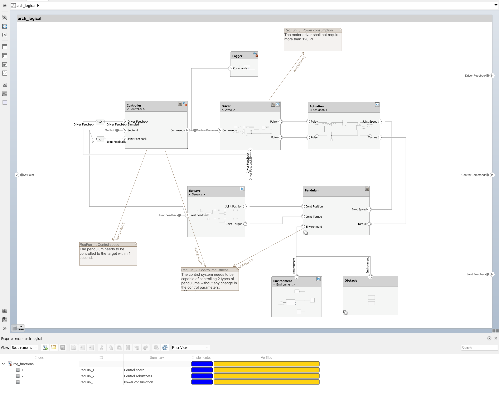
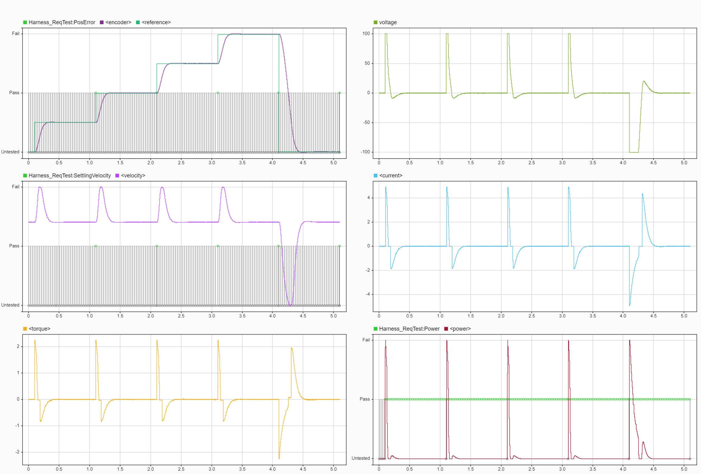

👨‍🔬 Authoring architectures via System Composer
===============================================

This tutorial provides a complete system architecture example using System Composer, building on the following resources:
- https://github.com/icub-tech-iit/training-matlab-pendulum
- https://github.com/icub-tech-iit/training-simscape-pendulum

In detail, the project consists of a system controlling a pendulum, showing how to deal with:
- Requirements
- Architectures
- Variant subsystems
- Test harnesses
- Test cases
- Digital threads

Open the project and browse it to discover how the requirements are linked to the architecture,
how the architecture is linked to the test harnesses, and how the test harnesses are linked to the test cases.  
This is the so-called **digital thread**.

|                                |
| :----------------------------: |
|  |

Run the test suite to verify that the system is working as expected.

|                        |
| :--------------------: |
|  |

https://github.com/icub-tech-iit/training-systemcomposer-pendulum/assets/3738070/806964fd-47a4-47af-8a7e-4d485ba7d0b5

### 🎓 Assignment
- Create a further requirement to verify the safety properties of the system when the pendulum gets
  in contact with an external obstacle while being driven by the controller at a constant velocity:  
  _"The contact shall be detected and the interaction force shall be reduced under $`1`$ $`\text{N}`$ within $`1`$ $`\text{s}`$"_.  
  _"Once the contact is detected, the system stops receiving further set-points"_.
- Enable the `Test Safety` in the test suite and associate the new requirement to the test case.
- Modify the controller to take the safety requirement into account.
- Run the test suite to validate your approach.

To complete the assignment do:
1. [Generate][1] a copy of this repository into your account. Tick in the option "include all branches" ✔
2. [Create the branch][2] `solution` off of the branch `master`.
3. [Commit][3] into the branch `solution` your development.
4. [Push][4]/sync the changes up to GitHub.
5. [Create a pull request][5] (**PR**) with `master` as _base branch_ and `solution` as _compare branch_.
6. [Request to review your PR][6] 👋 to turn in the assignment.

[1]: https://github.com/icub-tech-iit/training-systemcomposer-pendulum/generate
[2]: https://help.github.com/articles/creating-and-deleting-branches-within-your-repository
[3]: https://git-scm.com/docs/git-commit
[4]: https://help.github.com/articles/pushing-to-a-remote
[5]: https://help.github.com/articles/creating-a-pull-request
[6]: https://help.github.com/articles/requesting-a-pull-request-review

### 📦 Required MATLAB toolboxes and Simulink blocksets

- MATLAB
- Simulink
- System Composer
- Requirements Toolbox
- Motor Control Blockset
- Simscape
- Simscape Electrical
- Simscape Multibody
- Simulink Test
